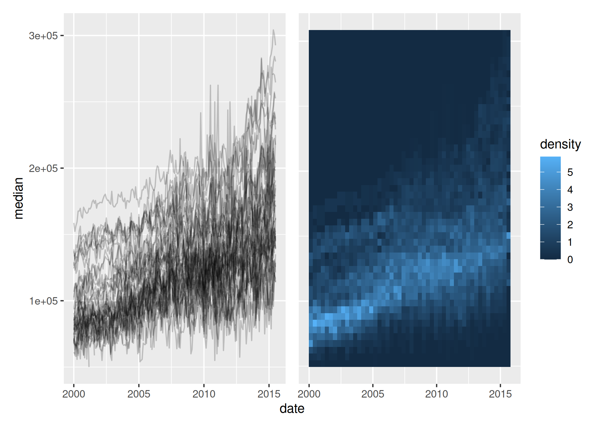
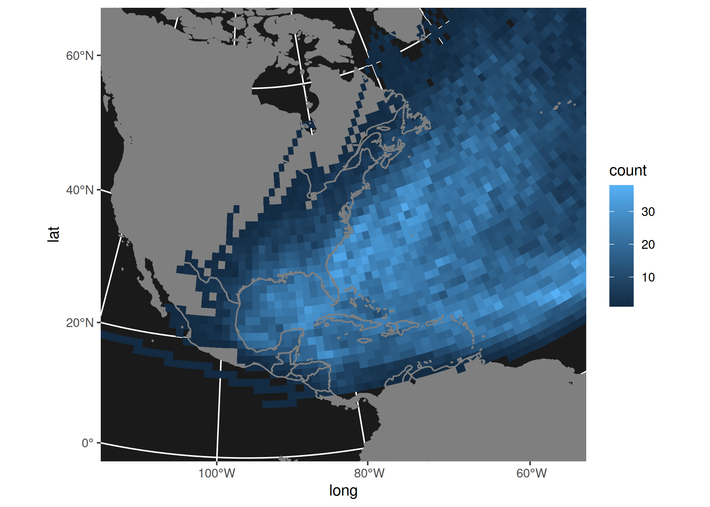

<!-- README.md is generated from README.Rmd. Please edit that file -->

# gglinedensity

<!-- badges: start -->

<!-- badges: end -->


The goal of gglinedensity is to bring the DenseLines algorithm to R via
ggplot2, providing a “derived density visualisation (that) allows users
both to see the aggregate trends of multiple (time) series and to
identify anomalous extrema” ([Moritz and Fisher,
2018](https://doi.org/10.48550/arXiv.1808.06019)).

## Installation

You can install gglinedensity like so:

``` r
install.packages("gglinedensity")
```

You can install the development version of gglinedensity like so:

``` r
# install.packages("pak")
pak::pak("hrryt/gglinedensity")
```

## Example

This is a basic example which shows you how to create a DenseLines
heatmap:

``` r
library(ggplot2)
library(gglinedensity)
library(patchwork)

p <- ggplot(txhousing, aes(date, median, group = city))
lines <- p + geom_line(alpha = 0.2, na.rm = TRUE)
heatmap <- p + stat_line_density(bins = 50, drop = FALSE, na.rm = TRUE)
lines + heatmap + plot_layout(axes = "collect")
```



You can also calculate the number of paths crossing a given bin, without
using the DenseLines algorithm:

``` r
ggplot(dplyr::storms, aes(long, lat, group = name)) +
    borders(colour = NA, fill = "grey50") +
    stat_path_density(geom = "tile", binwidth = 1.25, na.rm = TRUE) +
    borders() +
    xlim(-180, 0) +
    ylim(-40, 80) +
    coord_sf(
        crs = sf::st_crs(5070),
        default_crs = sf::st_crs(4326),
        xlim = c(-120, -30), ylim = c(0, 70)
    ) +
    theme(panel.background = element_rect(fill = "grey10"))
```


