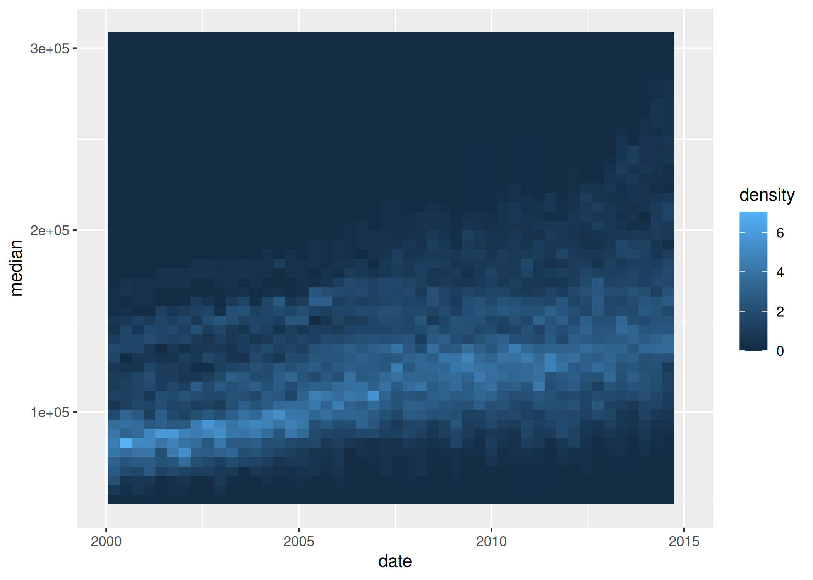

<!-- README.md is generated from README.Rmd. Please edit that file -->

# gglinedensity

<!-- badges: start -->
<!-- badges: end -->


The goal of gglinedensity is to bring the DenseLines algorithm to R via
ggplot2, providing a “derived density visualisation (that) allows users
both to see the aggregate trends of multiple (time) series and to
identify anomalous extrema” ([Moritz and Fisher,
2018](https://doi.org/10.48550/arXiv.1808.06019)).

## Installation

You can install the development version of gglinedensity like so:

``` r
# install.packages("remotes")
remotes::install_github("hrryt/gglinedensity")
```

## Example

This is a basic example which shows you how to solve a common problem:

``` r
library(ggplot2)
library(gglinedensity)
ggplot(txhousing, aes(date, median, group = city)) +
  stat_line_density(bins = 50, drop = FALSE) +
  xlim(2000, 2015)
#> Warning: Removed 886 rows containing non-finite outside the scale range
#> (`stat_line_density()`).
#> Warning: Removed 100 rows containing missing values or values outside the scale range
#> (`geom_raster()`).
```


